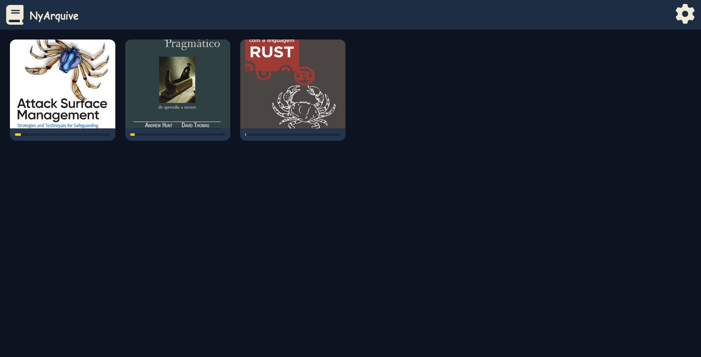

<h1 align="center"> NyArquive </h1>

    
    
    

NyArquive is a **ultra-lightweight**, **self-hosted library** that runs anywhere. No Docker, no database, no complexity. Just you and your PDFs

If this project helped you, consider starring it!

 

## Used technologies

- **Frontend**: React, Vite
- **Backend**: Node
- **PDF Reader**: PDF.js

## How to run

1. `git clone https://github.com/Guhszvv/NyArquive.git && cd NyArquive`
2. `chmod +x ./install.sh`
3. Drop your PDFs in `./books`
4. `cd backend && npm run start`

## License

This project is licensed under the [MIT License](LICENSE).
