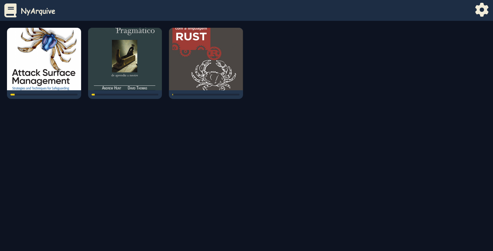

<h1 align="center"> NyArquive </h1>

    
    
    

NyArquive is a **ultra-lightweight**, **self-hosted library** that runs anywhere. No Docker, no database, no complexity. Just you and your PDFs

If this project helped you, consider starring it!

## Used technologies

- **Frontend**: React
- **Backend**: Rust
- **PDF Reader**: PDF.js

## How to run
>
> [!IMPORTANT]
> **Requires**: `pdftoppm` from Poppler

1. Download the latest release from [releases](https://github.com/Guhszvv/NyArquive/releases)
2. Extract: `tar -xzf nyarquive-<version>-linux-x86_64.tar.gz`
3. Drop your PDFs in `./books`
4. `./nyarquive`

> [!TIP]
> If needed, you can change the backend API address in `./dist/config.json`.
> This allows changing the server URL without rebuilding the frontend, which is **useful for external access and reverse proxy setups**.

## Keybinds

| Key | Used to       |
|-----|---------------|
| ↑   | Zoom In       |
| ↓   | Zoom Out      |
| ←   | Previous page |
| →   | Next Page     |
| Shift + D | Dark Mode Toggle |

## License

This project is licensed under the [MIT License](LICENSE).
